# AutoCompare AR — Incremental build tickets (detailed)

## Baseline (done — do not re-do)

- Go modular monolith + Next.js scaffold, Docker Postgres, migrations on startup
- Catalog schema + seed (Toyota / VW / Fiat) in [migrations/](migrations/)
- Hex layout; ports in [internal/domain/ports.go](internal/domain/ports.go)
- Live: `GET /health`, `GET /api/v1/brands`, `GET /api/v1/brands/{brand_id}/models`, `GET /api/v1/search/trims`
- Stubs remaining: listing/pricing repos, worker, default Next.js page; `TrimDetail` type exists but no `GetTrim` yet

## Shared conventions (every API ticket)

1. Extend port (if needed) → Postgres SQL → use case → handler → route → wire in `cmd/server/main.go`
2. Handlers parse HTTP only; business rules live in `application/`
3. JSON errors via existing `writeError` (`code` + `message`)
4. Update [README.md](README.md) API section when an endpoint ships
5. No new deps unless stdlib/`pgx` cannot do the job
6. **JSON field naming:** snake_case for all new/changed response DTOs (match `TrimSearchResult`). Align `Brand`/`Model` json tags when next touching those handlers.

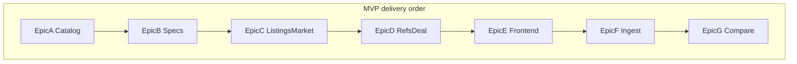

**MVP done when:** search a seeded Corolla trim → see specs, market summary, labeled references, deal badge for a typed price, and listings — live API + Next.js, no auth.

---

# API contract (MVP)

Base URL (local): `http://localhost:8080`  
Version prefix: `/api/v1`  
Auth: none in v1  
Content-Type: `application/json; charset=utf-8`

### Global rules

| Rule | Detail |
|------|--------|
| Money | Integer **ARS cents are not used** — prices are whole pesos as `int64` (e.g. `21500000`) |
| Currency | String ISO-like code; default `"ARS"` |
| Years | Calendar year `int` (e.g. `2019`) |
| IDs | Path params are integers; invalid → `400` with `INVALID_ID` |
| Empty lists | `200` + `[]`, never `null` |
| Null aggregates | Percentiles / optional fields use JSON `null` when unknown |
| Errors | `{ "code": "STRING_CODE", "message": "human readable" }` |

### Error codes (shared)

| HTTP | code | When |
|------|------|------|
| 400 | `INVALID_ID` | Non-integer path id |
| 400 | `INVALID_LIMIT` | `limit` not a positive int |
| 400 | `INVALID_YEAR` | `year` missing or not a positive int |
| 400 | `INVALID_PRICE` | `price` missing, non-int, or ≤ 0 |
| 400 | `INVALID_TRIM_IDS` | compare: wrong count or bad ids |
| 404 | `NOT_FOUND` | Trim (or required entity) missing |
| 500 | `INTERNAL_ERROR` | Unexpected failure |
| 503 | `DB_UNAVAILABLE` | Health check DB ping failed |

### Endpoint index

| Status | Method | Path | Ticket |
|--------|--------|------|--------|
| Done | GET | `/health` | baseline |
| Done | GET | `/api/v1/brands` | baseline |
| Done | GET | `/api/v1/brands/{brand_id}/models` | T1 |
| Done | GET | `/api/v1/search/trims` | T2 |
| Planned | GET | `/api/v1/trims/{trim_id}` | T3+T4 |
| Planned | GET | `/api/v1/trims/{trim_id}/listings` | T5 |
| Planned | GET | `/api/v1/trims/{trim_id}/market` | T6 |
| Planned | GET | `/api/v1/trims/{trim_id}/references` | T7 |
| Planned | GET | `/api/v1/trims/{trim_id}/deal` | T8 |
| Planned | GET | `/api/v1/compare` | T13 |

Worker ingest (T11/T12) is **CLI**, not HTTP.

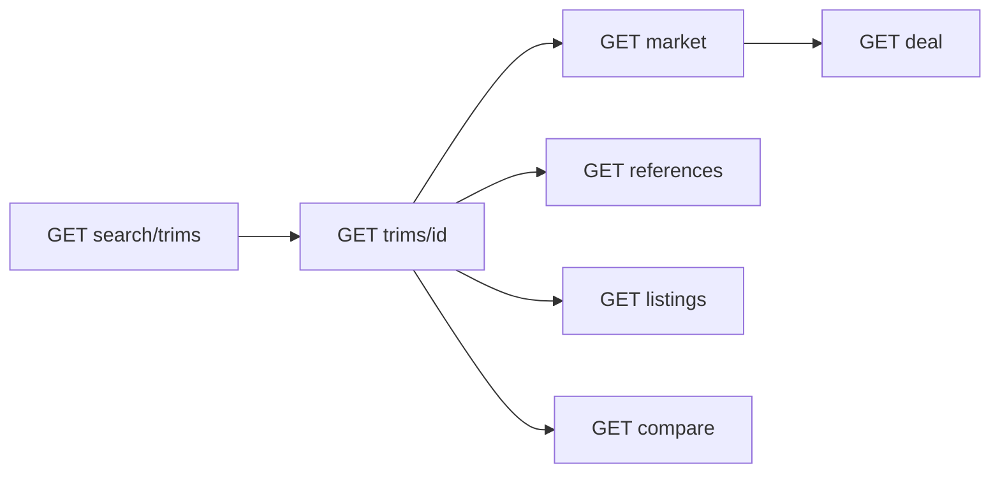

---

### `GET /health` — done

**200**

```json
{ "status": "ok" }
```

**503**

```json
{ "code": "DB_UNAVAILABLE", "message": "database unavailable" }
```

---

### `GET /api/v1/brands` — done

Lists catalog brands.

**200** (current Go default encoding — PascalCase; target snake_case below)

```json
[
  { "id": 1, "name": "Fiat", "created_at": "2026-01-01T00:00:00Z" },
  { "id": 2, "name": "Toyota", "created_at": "2026-01-01T00:00:00Z" }
]
```

**500** `INTERNAL_ERROR`

---

### `GET /api/v1/brands/{brand_id}/models` — done (T1)

**Path:** `brand_id` integer  

**200** — empty array if brand has no models

```json
[
  { "id": 1, "brand_id": 2, "name": "Corolla", "created_at": "2026-01-01T00:00:00Z" }
]
```

**400** `INVALID_ID`  
**500** `INTERNAL_ERROR`

---

### `GET /api/v1/search/trims` — done (T2)

| Query | Required | Default | Notes |
|-------|----------|---------|-------|
| `q` | no | — | Whitespace-only → `[]` |
| `limit` | no | `20` | Cap `50`; invalid → `INVALID_LIMIT` |

**200**

```json
[
  {
    "trim_id": 1,
    "trim_name": "XEi 2.0 CVT",
    "brand_name": "Toyota",
    "model_name": "Corolla",
    "generation_name": "E210",
    "year_from": 2019,
    "year_to": 2026
  }
]
```

**400** `INVALID_LIMIT`  
**500** `INTERNAL_ERROR`

---

### `GET /api/v1/trims/{trim_id}` — planned (T3, enriched in T4)

Vehicle sheet identity (+ specs/features after T4).

| Query | Required | Notes |
|-------|----------|-------|
| `year` | no | Echoed as `requested_year`; not validated against listings |

**200** (after T4)

```json
{
  "trim_id": 1,
  "trim_name": "XEi 2.0 CVT",
  "brand_name": "Toyota",
  "model_name": "Corolla",
  "generation_name": "E210",
  "year_from": 2019,
  "year_to": 2026,
  "requested_year": 2019,
  "specs": {
    "engine": "2.0",
    "displacement_cc": 1987,
    "horsepower": 170,
    "transmission": "CVT",
    "fuel": "nafta",
    "doors": 4,
    "seats": 5,
    "consumption_city": 8.5,
    "consumption_highway": 6.2
  },
  "features": [
    { "code": "abs", "name": "ABS", "category": "safety", "value": "true" },
    { "code": "esp", "name": "ESP", "category": "safety", "value": "true" },
    { "code": "airbags", "name": "Airbags", "category": "safety", "value": "7" }
  ]
}
```

Before T4: omit `specs` / `features` or send `null` / `[]`.  
Missing specs for a trim: `specs: null`, `features: []`.

**400** `INVALID_ID`  
**404** `NOT_FOUND`  
**500** `INTERNAL_ERROR`

---

### `GET /api/v1/trims/{trim_id}/listings` — planned (T5)

Active listings for trim + year, price ascending.

| Query | Required | Default | Notes |
|-------|----------|---------|-------|
| `year` | **yes** | — | else `INVALID_YEAR` |
| `limit` | no | `50` | Cap `100`; invalid → `INVALID_LIMIT` |

**200**

```json
[
  {
    "id": 10,
    "source": "seed",
    "external_id": "seed-corolla-xei-2019-1",
    "trim_id": 1,
    "year": 2019,
    "km": 120000,
    "price": 22500000,
    "currency": "ARS",
    "location": "Córdoba",
    "url": "https://example.com/listing/1",
    "last_seen_at": "2026-08-01T12:00:00Z"
  }
]
```

**400** `INVALID_ID` / `INVALID_YEAR` / `INVALID_LIMIT`  
**500** `INTERNAL_ERROR`  
(Unknown trim with no rows → `[]`, not 404 — listings are observations, not identity.)

---

### `GET /api/v1/trims/{trim_id}/market` — planned (T6)

Market distribution from active listings.

| Query | Required |
|-------|----------|
| `year` | **yes** |

**200** — with data

```json
{
  "trim_id": 1,
  "year": 2019,
  "count": 12,
  "median": 26000000,
  "minimum": 22500000,
  "maximum": 29000000,
  "p25": 25200000,
  "p75": 27100000,
  "currency": "ARS"
}
```

**200** — no listings

```json
{
  "trim_id": 1,
  "year": 2019,
  "count": 0,
  "median": null,
  "minimum": null,
  "maximum": null,
  "p25": null,
  "p75": null,
  "currency": "ARS"
}
```

**400** `INVALID_ID` / `INVALID_YEAR`  
**500** `INTERNAL_ERROR`

---

### `GET /api/v1/trims/{trim_id}/references` — planned (T7)

Guide / fiscal reference prices. Always label source; DNRPA is fiscal.

| Query | Required |
|-------|----------|
| `year` | **yes** |

**200**

```json
[
  {
    "id": 1,
    "trim_id": 1,
    "year": 2019,
    "source": "CCA",
    "kind": "guide",
    "price": 25500000,
    "currency": "ARS",
    "observed_at": "2026-08-01T00:00:00Z"
  },
  {
    "id": 2,
    "trim_id": 1,
    "year": 2019,
    "source": "ACARA",
    "kind": "guide",
    "price": 25800000,
    "currency": "ARS",
    "observed_at": "2026-08-01T00:00:00Z"
  },
  {
    "id": 3,
    "trim_id": 1,
    "year": 2019,
    "source": "DNRPA",
    "kind": "fiscal",
    "price": 24100000,
    "currency": "ARS",
    "observed_at": "2026-08-01T00:00:00Z"
  }
]
```

`kind`: `guide` | `fiscal` | `market`

**400** `INVALID_ID` / `INVALID_YEAR`  
**500** `INTERNAL_ERROR`

---

### `GET /api/v1/trims/{trim_id}/deal` — planned (T8) — hero

Compare an asking price to market median / band.

| Query | Required |
|-------|----------|
| `year` | **yes** |
| `price` | **yes** (int pesos &gt; 0) |

**200** — enough data

```json
{
  "trim_id": 1,
  "year": 2019,
  "price": 21500000,
  "currency": "ARS",
  "status": "ok",
  "band": "below",
  "delta_ars": 4500000,
  "delta_pct": 17.3,
  "market": {
    "count": 12,
    "median": 26000000,
    "p25": 25200000,
    "p75": 27100000
  },
  "disclaimer": "Estimación a partir de publicaciones comparables; el precio publicado no es precio de venta."
}
```

**Semantics**

| Field | Meaning |
|-------|---------|
| `delta_ars` | `median - price` (positive ⇒ asking is cheaper than median) |
| `delta_pct` | `(median - price) / median * 100`, one decimal |
| `band` | `below` if price &lt; p25; `near` if p25..p75; `above` if &gt; p75 |
| `status` | `ok` \| `insufficient_data` |

**200** — insufficient data (still 200 so UI stays simple)

```json
{
  "trim_id": 1,
  "year": 2019,
  "price": 21500000,
  "currency": "ARS",
  "status": "insufficient_data",
  "band": "insufficient_data",
  "delta_ars": null,
  "delta_pct": null,
  "market": {
    "count": 0,
    "median": null,
    "p25": null,
    "p75": null
  },
  "disclaimer": "No hay publicaciones suficientes para estimar el mercado de esta versión/año."
}
```

**400** `INVALID_ID` / `INVALID_YEAR` / `INVALID_PRICE`  
**500** `INTERNAL_ERROR`

---

### `GET /api/v1/compare` — planned (T13)

Side-by-side up to 3 trims for one year.

| Query | Required | Notes |
|-------|----------|-------|
| `trim_ids` | **yes** | Comma-separated; **min 2, max 3** |
| `year` | **yes** | |

**200**

```json
{
  "year": 2019,
  "trims": [
    {
      "trim_id": 1,
      "trim_name": "XEi 2.0 CVT",
      "brand_name": "Toyota",
      "model_name": "Corolla",
      "specs": { "engine": "2.0", "transmission": "CVT", "horsepower": 170 },
      "market": { "count": 12, "median": 26000000, "currency": "ARS" }
    },
    {
      "trim_id": 2,
      "trim_name": "XLi 1.8 CVT",
      "brand_name": "Toyota",
      "model_name": "Corolla",
      "specs": { "engine": "1.8", "transmission": "CVT", "horsepower": 140 },
      "market": { "count": 8, "median": 23500000, "currency": "ARS" }
    }
  ],
  "features": [
    {
      "code": "esp",
      "name": "ESP",
      "category": "safety",
      "values": { "1": "true", "2": "true" }
    },
    {
      "code": "airbags",
      "name": "Airbags",
      "category": "safety",
      "values": { "1": "7", "2": "2" }
    }
  ]
}
```

`features[].values` keys are trim id strings → feature value or omit / `"—"` when absent.

**400** `INVALID_TRIM_IDS` / `INVALID_YEAR`  
**404** `NOT_FOUND` if any trim id missing  
**500** `INTERNAL_ERROR`

---

### Non-HTTP: worker ingest (T11)

Not part of the public API. Contract for the importer input file:

```json
[
  {
    "source": "seed",
    "external_id": "ml-123",
    "trim_id": 1,
    "year": 2019,
    "km": 98000,
    "price": 24800000,
    "currency": "ARS",
    "location": "Rosario",
    "url": "https://example.com/x"
  }
]
```

Upsert key: `(source, external_id)`. Updates `price`, `km`, `last_seen_at`, sets `active=true`.

---

# Epic A — Catalog read APIs

---

## T1 — List models by brand

| Field | Value |
|-------|-------|
| **Depends on** | Baseline |
| **Ship** | `GET /api/v1/brands/{brandID}/models` |
| **Priority** | P0 — unblocks browse/search UX |

### Goal

Return models for a brand so clients can drill brand → model before trim search. Replaces empty stub on `ListModelsByBrand`.

### Scope

**In**
- Real SQL: `SELECT id, brand_id, name, created_at FROM models WHERE brand_id = $1 ORDER BY name`
- Use case `ListModelsByBrand`
- Handler parses `{brandID}` from path; invalid ID → 400
- Route registration + `main` wiring (extend `Handler` constructor like `listBrands`)

**Out**
- Nested trims in this response
- Pagination (seed catalog is tiny)

### Files

- [internal/infrastructure/postgres/vehicle_repository.go](internal/infrastructure/postgres/vehicle_repository.go) — implement stub
- `internal/application/list_models_by_brand.go` — new
- [internal/delivery/http/handler.go](internal/delivery/http/handler.go) — method + constructor field
- [internal/delivery/http/router.go](internal/delivery/http/router.go) — `GET /api/v1/brands/{brandID}/models`
- [cmd/server/main.go](cmd/server/main.go) — wire
- [README.md](README.md) — document endpoint

### Acceptance criteria

- `GET /api/v1/brands/{toyotaID}/models` returns `[{"ID":…,"BrandID":…,"Name":"Corolla",…}]`
- Unknown `brandID` with no rows → `[]` (200), not 500
- Non-integer `brandID` → 400
- Follows same layering as `ListBrands`

### Architecture

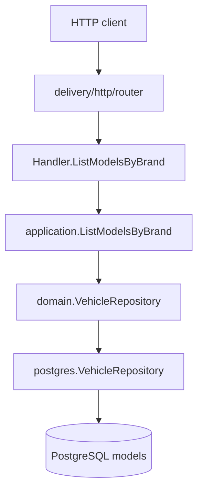

### Sequence

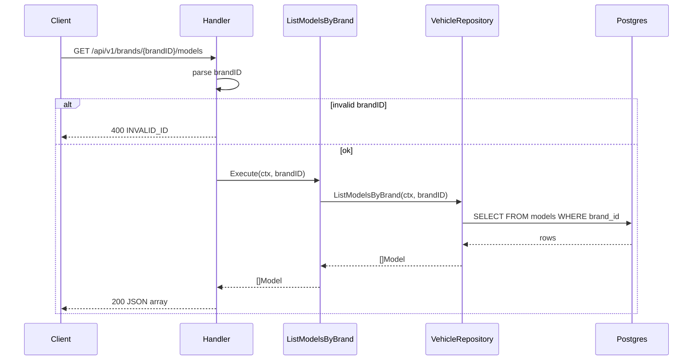

---

## T2 — Search trims

| Field | Value |
|-------|-------|
| **Depends on** | Baseline (T1 optional; can parallel) |
| **Ship** | `GET /api/v1/search/trims?q=&limit=` |
| **Priority** | P0 — primary discovery path |

### Goal

Free-text search across brand / model / trim names so the UI can jump straight to a version (e.g. `Corolla XEi`).

### Scope

**In**
- Implement `SearchTrims` with JOIN `brands → models → generations → trims`
- Match `ILIKE '%' || q || '%'` on brand, model, and trim name
- Default `limit=20`, cap at 50
- Response must be UI-ready: `trim_id`, `trim_name`, `brand_name`, `model_name`, `generation_name`, `year_from`, `year_to`
- Empty / whitespace `q` → `[]` (200)

**Out**
- Fuzzy/typo tolerance, ranking ML
- Filter by year query param (later)

### Design decision

Add `TrimSearchResult` in `domain` (or application DTO) rather than overloading bare `Trim` — search needs denormalized names the entity does not own. Keep port signature returning that type (extend `VehicleRepository.SearchTrims` return type).

### Files

- [internal/domain/vehicle.go](internal/domain/vehicle.go) / [ports.go](internal/domain/ports.go) — result type + port return
- [internal/infrastructure/postgres/vehicle_repository.go](internal/infrastructure/postgres/vehicle_repository.go)
- `internal/application/search_trims.go`
- handler + router + main + README

### Acceptance criteria

- `q=corolla` returns XEi and XLi rows with brand `Toyota`
- `q=` → `[]`
- `limit` honored; over-cap clamped to 50
- Results ordered stably (e.g. brand, model, trim name)

### Architecture

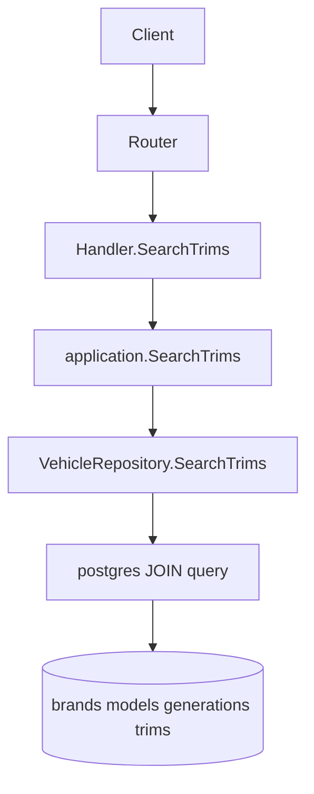

### Sequence

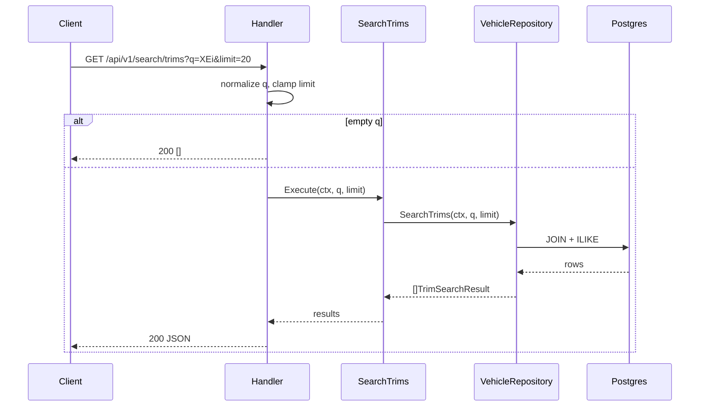

---

## T3 — Trim detail

| Field | Value |
|-------|-------|
| **Depends on** | T2 recommended (search provides IDs) |
| **Ship** | `GET /api/v1/trims/{trimID}?year=` |
| **Priority** | P0 — vehicle sheet backbone |

### Goal

Canonical vehicle identity for one trim: brand, model, generation, trim, year range. Optional `year` is echoed for clients that will call market/deal next. Specs arrive in T4.

### Scope

**In**
- New port method: `GetTrim(ctx, trimID) (TrimDetail, error)` — **missing today**
- `TrimDetail` includes IDs + names up the hierarchy
- 404 when trim not found (`ErrNotFound` from repo → handler maps)
- `year` query: parse if present; do not validate against listings yet; include in response as `requested_year`

**Out**
- Specs/features (T4)
- Market/listings inline (separate endpoints)

### Files

- [internal/domain/vehicle.go](internal/domain/vehicle.go) — `TrimDetail`
- [internal/domain/ports.go](internal/domain/ports.go) — `GetTrim`
- postgres vehicle repo + `get_trim.go` use case + handler/router/main/README

### Acceptance criteria

- Known seed trim ID returns full identity JSON
- Unknown ID → 404 `NOT_FOUND`
- `?year=2019` echoes year without failing if no listings yet

### Architecture

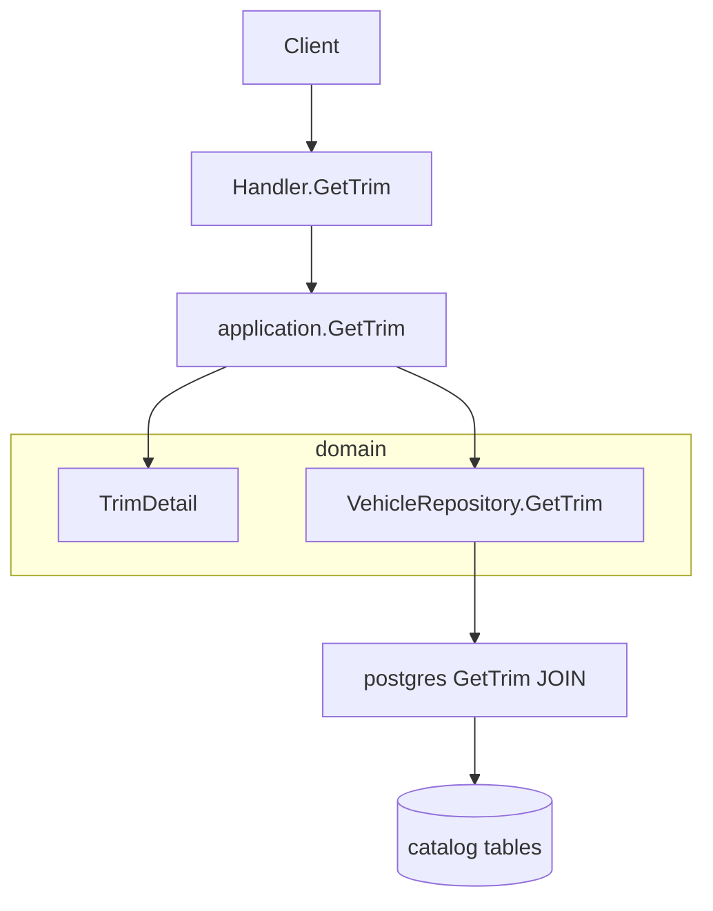

### Sequence

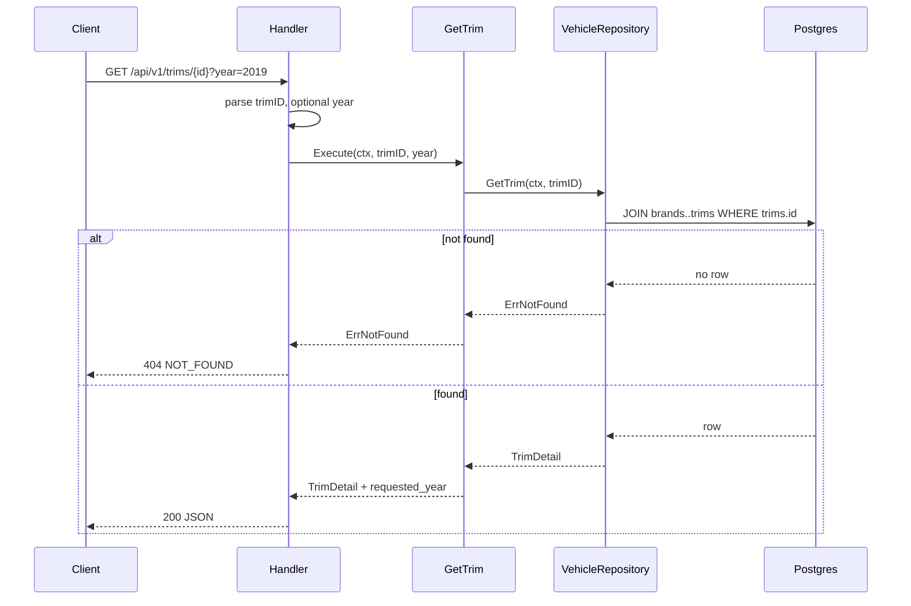

---

# Epic B — Specs and features

---

## T4 — Specs / features schema + enrich detail

| Field | Value |
|-------|-------|
| **Depends on** | T3 |
| **Ship** | Trim detail includes motor/safety/equipment for seeded trims |
| **Priority** | P0 — answers “what does this version include?” |

### Goal

Persist and expose equipment/specs without mixing them into listing rows. Extend T3 response; no new public route required unless preferred as `/trims/{id}/specs` (default: **enrich GetTrim**).

### Scope

**In**
- Migration `003_create_specs_features`:
  - `vehicle_specs` (1:1 trim): engine, displacement, horsepower, transmission, fuel, doors, seats, consumption_city, consumption_highway
  - `features` catalog: `id`, `code`, `name`, `category` (safety / brakes / comfort / …)
  - `vehicle_features`: `trim_id`, `feature_id`, `value` (text/bool-as-text)
- Seed for all 4 existing trims
- Load specs + features inside `GetTrim` (2 extra queries or one JOIN + features query)

**Out**
- Feature-filter search (“ESP + 6 airbags under $25M”)
- Spec ingestion scraper

### Data model sketch

```mermaid
erDiagram
  trims ||--o| vehicle_specs : has
  trims ||--o{ vehicle_features : has
  features ||--o{ vehicle_features : catalog
  trims {
    int id PK
    string name
  }
  vehicle_specs {
    int trim_id PK_FK
    string engine
    string transmission
    int horsepower
  }
  features {
    int id PK
    string code UK
    string category
  }
  vehicle_features {
    int trim_id FK
    int feature_id FK
    string value
  }
```

### Files

- `migrations/003_*.up.sql` / `.down.sql`
- domain types `VehicleSpec`, feature structs
- postgres: load methods used by `GetTrim` or small helpers on same repo
- Update GetTrim use case / JSON shape
- README

### Acceptance criteria

- Corolla XEi detail shows engine/transmission and features (e.g. ABS, ESP, airbags)
- Trim without seed specs still returns identity; specs/features null or empty — not 500
- Migration reversible via `.down.sql`

### Architecture

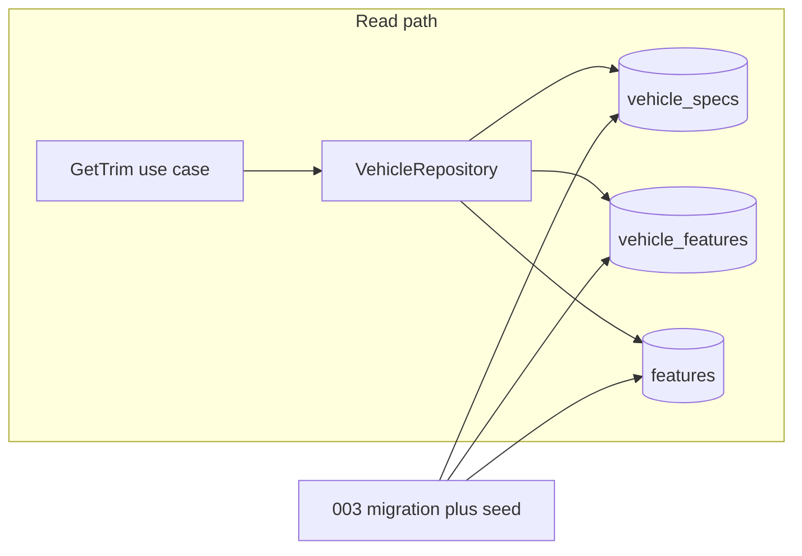

### Sequence

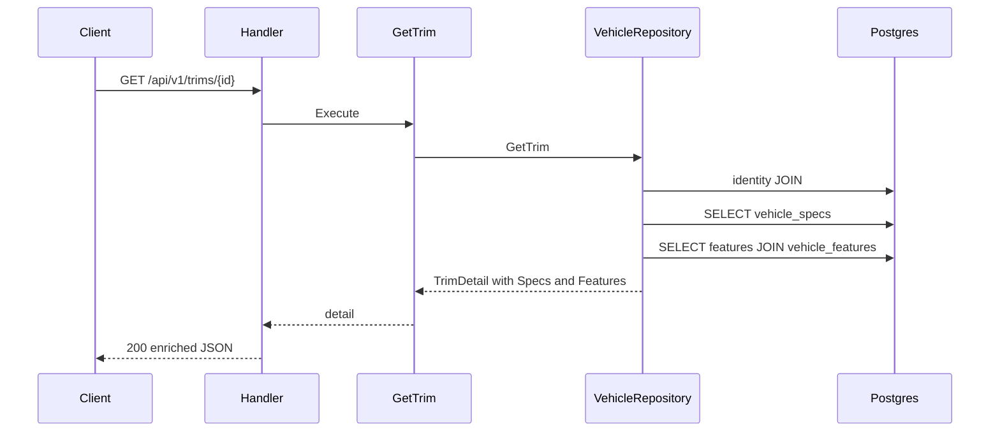

---

# Epic C — Listings and market math

---

## T5 — Listings table + list endpoint

| Field | Value |
|-------|-------|
| **Depends on** | T3 |
| **Ship** | `GET /api/v1/trims/{trimID}/listings?year=&limit=` |
| **Priority** | P0 — market observations |

### Goal

Store specific ads separately from vehicle identity. Serve active listings for a trim+year so the UI can show real published prices.

### Scope

**In**
- Migration `004_create_listings`:
  - `vehicle_listings`: id, source, external_id, trim_id, year, km, price, currency, location, url, first_seen_at, last_seen_at, active
  - UNIQUE `(source, external_id)`
  - Index `(trim_id, year)` WHERE active; index on price for active rows
- Seed 8–15 listings across ≥2 trim/years (spread prices for later percentiles)
- Replace stub [listing_repository.go](internal/infrastructure/postgres/listing_repository.go): inject `*pgxpool.Pool`
- Use case `ListListings` + endpoint
- Default limit 50; active only; order by price ASC

**Out**
- Ingestion worker (T11)
- Soft-delete lifecycle beyond `active` boolean

### Critical separation

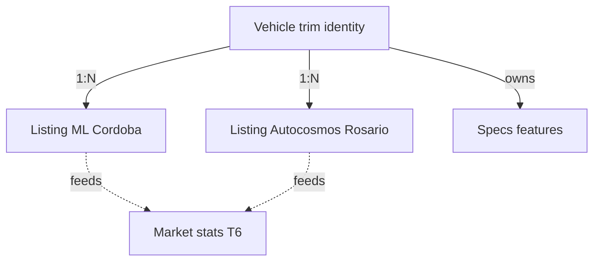

### Files

- `migrations/004_*`
- [internal/domain/listing.go](internal/domain/listing.go) — already sketched; align columns
- [internal/infrastructure/postgres/listing_repository.go](internal/infrastructure/postgres/listing_repository.go)
- `internal/application/list_listings.go`
- handler/router/main — construct `NewListingRepository(pool)`
- README

### Acceptance criteria

- Seeded Corolla XEi 2019 returns multiple listings with km/price/location
- Inactive rows excluded
- Unknown trim with no listings → `[]` (200)
- Missing `year` → 400

### Architecture

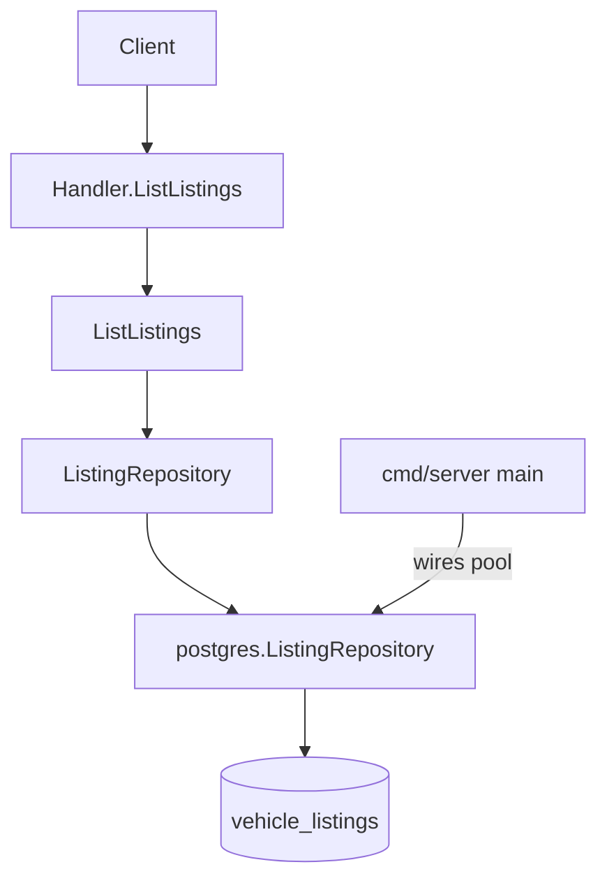

### Sequence

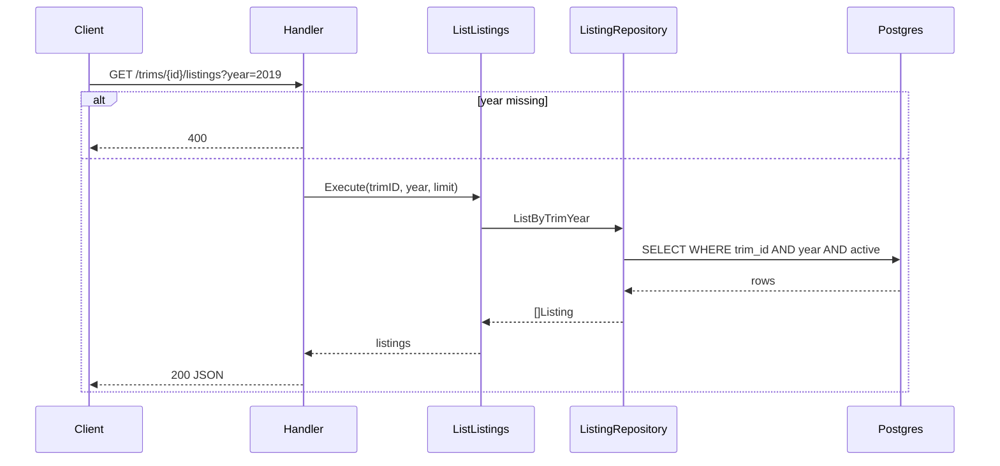

---

## T6 — Market summary

| Field | Value |
|-------|-------|
| **Depends on** | T5 |
| **Ship** | `GET /api/v1/trims/{trimID}/market?year=` |
| **Priority** | P0 — “real market price” |

### Goal

Aggregate active listing prices into count / median / min / max / p25 / p75 for a trim+year.

### Scope

**In**
- Implement `ListingRepository.MarketSummary` in SQL using `percentile_cont(0.25|0.5|0.75) WITHIN GROUP (ORDER BY price)` plus `count/min/max`
- Use case `GetMarketSummary` (thin)
- Empty sample: `count=0`, percentile fields `null` — **never invent numbers**
- Require `year`

**Out**
- Similar-trim weighting (deferred)
- Sold-price vs listed-price distinction

### Files

- [listing_repository.go](internal/infrastructure/postgres/listing_repository.go) — `MarketSummary`
- `internal/application/get_market_summary.go`
- handler/router/main/README
- Optional: table-driven unit test with fake repo for empty vs non-empty JSON mapping

### Acceptance criteria

- Seeded trim/year with N prices returns sensible median and band
- Trim/year with 0 listings → count 0, nulls, HTTP 200
- Matches DESIGN §2 market math labels

### Architecture

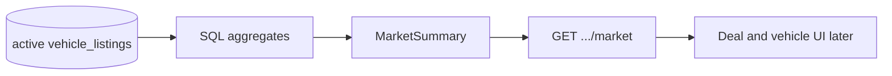

### Sequence

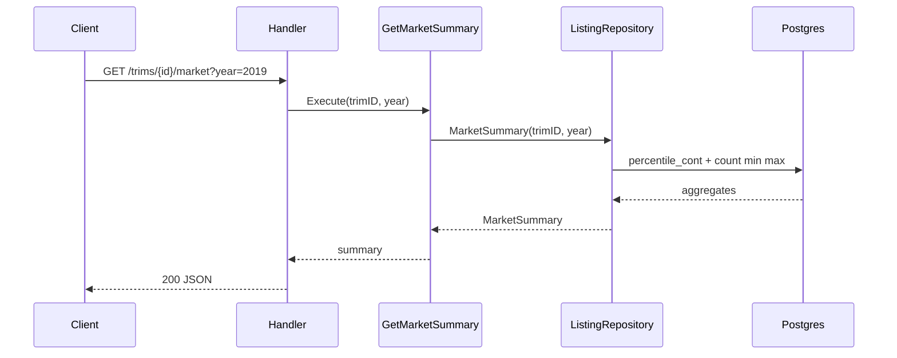

---

# Epic D — Reference prices and deal signal

---

## T7 — Price references

| Field | Value |
|-------|-------|
| **Depends on** | T3 |
| **Ship** | `GET /api/v1/trims/{trimID}/references?year=` |
| **Priority** | P0 — CCA/ACARA/DNRPA as labeled inputs |

### Goal

Store guide/fiscal valuations per trim+year with clear source labeling. DNRPA must be distinguishable as fiscal, not market.

### Scope

**In**
- Migration `005_create_price_references`:
  - id, trim_id, year, source, price, currency, observed_at
  - optional `kind` (`guide` | `fiscal` | `market`) — or encode via source naming; prefer explicit `kind`
  - Index `(trim_id, year)`
- Seed CCA, ACARA, DNRPA for key seeded trim/years
- Wire [pricing_repository.go](internal/infrastructure/postgres/pricing_repository.go) with pool
- Use case + endpoint; require `year`

**Out**
- Scraping CCA/ACARA (legal risk — DESIGN §9)
- Treating DNRPA as market median

### Files

- `migrations/005_*`
- [internal/domain/pricing.go](internal/domain/pricing.go) — add `Kind` if needed
- pricing repo + `list_references.go` + handler/router/main/README

### Acceptance criteria

- Response includes multiple sources; DNRPA marked fiscal
- Empty year sample → `[]`
- README states references are estimative inputs, not “the” price

### Architecture

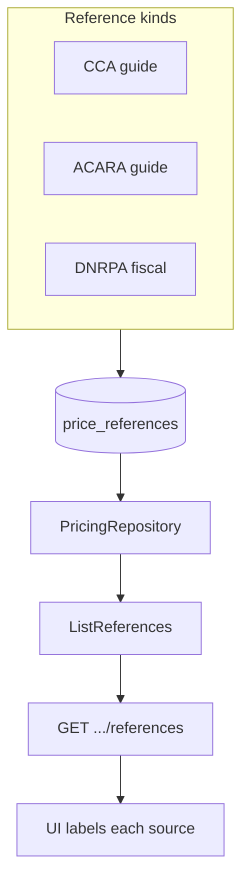

### Sequence

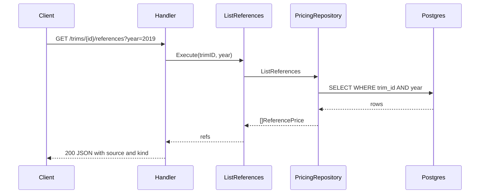

---

## T8 — Deal assessment (“¿Está barato?”)

| Field | Value |
|-------|-------|
| **Depends on** | T6 |
| **Ship** | `GET /api/v1/trims/{trimID}/deal?year=&price=` |
| **Priority** | P0 — product hero |

### Goal

Given a published asking price, say how it sits vs market median (and optionally p25/p75). Pure application logic on top of `MarketSummary`.

### Scope

**In**
- Use case `AssessDeal`:
  - Load market summary via `ListingRepository` (or `GetMarketSummary` use case)
  - If `count == 0` → status `insufficient_data` (200 or 422 — pick **200 with status field** so UI stays simple)
  - Else compute `delta = median - price`, `delta_pct`, band:
    - `below` if price &lt; p25 (or &lt; median − 5% if p25 null)
    - `near` if between p25 and p75
    - `above` if price &gt; p75
  - Always include disclaimer string (listed ≠ sold)
- Query params `year` + `price` required; price &gt; 0
- **No SQL in use case** beyond what the port returns

**Out**
- ML scoring, km/location adjustments
- Persisting assessment history

### Response shape (contract)

```text
trim_id, year, price,
market: { count, median, p25, p75 },
delta_ars, delta_pct,
band: below|near|above|insufficient_data,
disclaimer: "..."
```

### Files

- `internal/application/assess_deal.go` (+ optional `assess_deal_test.go` with fake listing repo)
- domain type `DealAssessment` if useful
- handler/router/main/README

### Acceptance criteria

- Price well below seeded median → `below` + negative delta_pct magnitude as “cheaper”
- No listings → `insufficient_data`, no fake green badge numbers
- Missing price/year → 400
- Logic unit-tested without Postgres

### Architecture

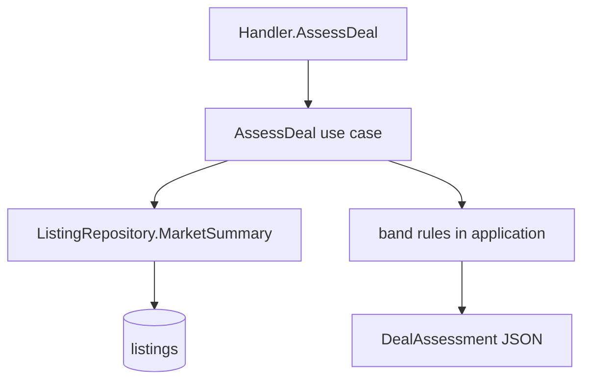

### Sequence

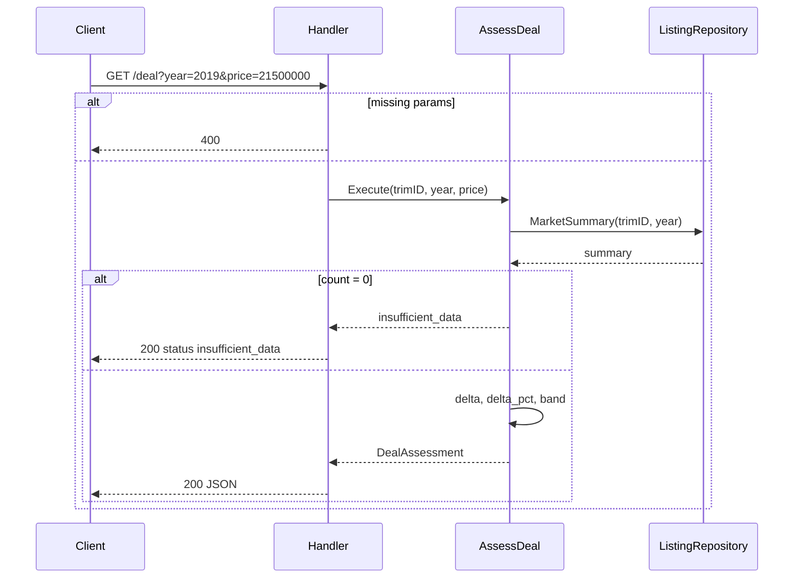

---

# Epic E — Frontend vertical slice

---

## T9 — Web shell + API client

| Field | Value |
|-------|-------|
| **Depends on** | T2 for search; stubs OK until T8 |
| **Ship** | Replace default Next.js template; typed API helpers |
| **Priority** | P0 — UI foundation |

### Goal

Brand-first shell and a thin API client so T10 only builds pages. Spanish copy; AutoCompare as hero signal.

### Scope

**In**
- `NEXT_PUBLIC_API_URL` (default `http://localhost:8080`)
- Layout: brand name hero-level, one search field/CTA, no dashboard chrome
- `web/src/lib/api.ts`: `searchTrims`, `getTrim`, `getMarket`, `getDeal`, `getListings`, `getReferences`
- Shared types mirroring API JSON
- Strip create-next-app boilerplate from [web/src/app/page.tsx](web/src/app/page.tsx)

**Out**
- Auth, dark-mode theme system, component library, React Query unless already present
- Full vehicle page (T10)

### Files

- [web/src/app/layout.tsx](web/src/app/layout.tsx), `page.tsx`, `globals.css`
- `web/src/lib/api.ts`, `web/src/lib/types.ts`
- `.env.example` / web env docs in README

### Acceptance criteria

- Home shows AutoCompare + search input
- `api.searchTrims('corolla')` hits Go API when server is up
- No default Next.js marketing template left

### Architecture

```mermaid
flowchart LR
  Browser --> Next[Next.js web]
  Next --> Lib[lib/api.ts]
  Lib --> Go[Go API :8080]
  Go --> PG[(Postgres)]
```

### Sequence

```mermaid
sequenceDiagram
  participant U as User
  participant Page as Home page
  participant API as lib/api
  participant Go as Go server

  U->>Page: open /
  Page-->>U: brand + search CTA
  U->>Page: type query submit
  Page->>API: searchTrims(q)
  API->>Go: GET /api/v1/search/trims?q=
  Go-->>API: JSON results
  API-->>Page: typed results
  Page-->>U: result list links ready for T10 routes
```

---

## T10 — Search → vehicle page with deal badge

| Field | Value |
|-------|-------|
| **Depends on** | T9, T3, T4, T6, T7, T8 |
| **Ship** | End-to-end decision UX |
| **Priority** | P0 — MVP user-visible product |

### Goal

User searches a trim, opens the sheet, sees market + references + specs, types an asking price, gets the deal badge. Listings listed below.

### Scope

**In**
- Routes: `/` search results; `/trims/[id]?year=` vehicle sheet
- Sections (one job each): identity header, market summary, references table, deal calculator + badge, specs/features, listings
- Deal badge copy per DESIGN hero (“$X debajo del mercado” / percent)
- Year selector defaulting to generation midpoint or query param
- Loading and empty/insufficient_data states

**Out**
- Comparator (T13), alerts, charts, cards-as-decoration

### Files

- `web/src/app/page.tsx` — search
- `web/src/app/trims/[id]/page.tsx` — detail
- Small presentational components under `web/src/components/` only if reused

### Acceptance criteria

- Corolla XEi 2019 path works against seed data without manual API calls
- Typing a low price shows below-market badge; high price shows above
- Insufficient data does not show a green fake deal
- Mobile + desktop readable; first viewport is one composition (brand/search or vehicle identity + deal)

### Architecture

```mermaid
flowchart TB
  subgraph pages [Next.js pages]
    Search["/ search"]
    Detail["/trims/id"]
  end
  Search -->|navigate| Detail
  Detail --> T[getTrim]
  Detail --> M[getMarket]
  Detail --> R[getReferences]
  Detail --> L[getListings]
  Detail --> D[getDeal on price change]
  T --> Go[Go API]
  M --> Go
  R --> Go
  L --> Go
  D --> Go
```

### Sequence

```mermaid
sequenceDiagram
  participant U as User
  participant S as Search page
  participant V as Vehicle page
  participant Go as Go API

  U->>S: query Toyota Corolla XEi
  S->>Go: GET /search/trims?q=
  Go-->>S: hits
  U->>V: open trim + year
  par parallel fetch
    V->>Go: GET /trims/{id}
    V->>Go: GET /market?year=
    V->>Go: GET /references?year=
    V->>Go: GET /listings?year=
  end
  Go-->>V: sheet data
  V-->>U: market + specs + listings
  U->>V: enter price 21500000
  V->>Go: GET /deal?year=&price=
  Go-->>V: band below
  V-->>U: deal badge
```

---

# Epic F — Ingestion

---

## T11 — Worker + CSV/JSON listing upsert

| Field | Value |
|-------|-------|
| **Depends on** | T5 (listings schema); T7 optional for refs |
| **Ship** | `cmd/worker` imports file → upserts listings |
| **Priority** | P1 — stop hand-writing SQL seeds to grow data |

### Goal

Background entrypoint that upserts listings by `(source, external_id)`, updating `last_seen_at`. No scraping yet — local file only.

### Scope

**In**
- Replace [cmd/worker/main.go](cmd/worker/main.go) stub: env `DATABASE_URL`, path arg or `INGEST_FILE`
- Port methods for upsert: extend `ListingRepository` with `Upsert(ctx, Listing) error` (or batch)
- Adapter `internal/infrastructure/ingestion/file_listings.go`: parse JSON/CSV → domain `Listing`
- Idempotent re-run; set `active=true` on upsert
- Structured logs (count inserted/updated/skipped)

**Out**
- HTTP scrape of CCA/ACARA
- Kafka/cron platform — plain CLI/`go run` is enough
- Spec ingestion pipeline

### Files

- [cmd/worker/main.go](cmd/worker/main.go)
- [internal/infrastructure/ingestion/](internal/infrastructure/ingestion/)
- listing repo upsert
- sample `testdata/listings.json`
- Makefile target `make ingest` optional
- README worker section + legal note pointing to DESIGN §9

### Acceptance criteria

- Running worker twice on same file does not duplicate rows
- New external_id inserts; existing updates price/km/`last_seen_at`
- Worker does not embed SQL strings in `main`

### Architecture

```mermaid
flowchart TB
  File[listings.json or csv] --> Ingest[ingestion.FileListings]
  Ingest --> Norm[normalize rows]
  Norm --> Port[ListingRepository.Upsert]
  Port --> Repo[postgres]
  Repo --> DB[(vehicle_listings)]
  Worker[cmd/worker main] -->|composition root| Ingest
  Worker --> Repo
```

### Sequence

```mermaid
sequenceDiagram
  participant Op as Operator
  participant W as cmd/worker
  participant I as File importer
  participant R as ListingRepository
  participant DB as Postgres

  Op->>W: run with INGEST_FILE
  W->>I: Import(path)
  loop each row
    I->>I: map to Listing
    I->>R: Upsert(listing)
    R->>DB: INSERT ON CONFLICT UPDATE
    DB-->>R: ok
  end
  I-->>W: stats
  W-->>Op: log inserted/updated/skipped
```

---

## T12 — First allowed live market source (stretch)

**Cancelled for MVP.** File ingest (T11) + seed listings are enough. Do not add a live Mercado Libre importer until the Corolla path is proven by hand.

| Field | Value |
|-------|-------|
| **Depends on** | T11 + explicit ToS/API go-ahead |
| **Ship** | One live importer (e.g. Mercado Libre API if permitted) |
| **Priority** | P2 — stretch |

### Goal

Pull real listings from one **allowed** source into the same upsert path. Soft-fail unmatched titles.

### Scope

**In**
- Importer under `ingestion/mercadolibre` (or chosen source) implementing same output as file importer
- Naive title → `trim_id` map for seed brands only (config table or static map)
- Unmatched → log + skip (no bad FK)
- Rate-limit politely; store `source` + `external_id` + url

**Out**
- Full canonicalization engine
- Multiple sources in parallel
- Wholesale reproduction of CCA/ACARA guides

### Files

- `internal/infrastructure/ingestion/<source>/`
- optional `trim_aliases` table migration if static map is insufficient
- worker subcommand or `-source=ml|file` flag
- README: compliance checklist before enable

### Acceptance criteria

- Dry-run mode lists matches/skips without writing
- Successful run increases active listings for mapped trims
- Failure of external API exits non-zero with clear log; DB consistent

### Architecture

```mermaid
flowchart TB
  Ext[External allowed API] --> Client[ingestion source client]
  Client --> Map[title to trim_id map]
  Map -->|matched| Upsert[ListingRepository.Upsert]
  Map -->|unmatched| Log[log skip]
  Upsert --> DB[(vehicle_listings)]
```

### Sequence

```mermaid
sequenceDiagram
  participant W as Worker
  participant S as Source client
  participant API as External API
  participant Map as Trim mapper
  participant R as ListingRepository

  W->>S: Run(ctx)
  S->>API: fetch search page/batch
  API-->>S: items
  loop each item
    S->>Map: Resolve(title)
    alt matched
      Map-->>S: trimID
      S->>R: Upsert
    else unmatched
      Map-->>S: none
      S->>S: log skip
    end
  end
  S-->>W: stats
```

---

# Epic G — Comparator

---

## T13 — Side-by-side trim compare

| Field | Value |
|-------|-------|
| **Depends on** | T4, T6, T10 |
| **Ship** | `GET /api/v1/compare?trim_ids=1,2,3&year=` + UI |
| **Priority** | P1 — closes MVP feature F |

### Goal

Compare up to 3 trims on identity, key specs/features, and market median for a year.

### Scope

**In**
- API: parse `trim_ids` (comma-separated, max 3, min 2); require `year`
- Use case loads each trim detail + market summary (sequential or errgroup)
- UI: from vehicle page “Comparar” adds trim to compare set; `/compare?trim_ids=&year=`
- Feature matrix: union of feature codes; show value or “—”

**Out**
- Price history, alerts, auth/monetization
- More than 3 trims

### Files

- `internal/application/compare_trims.go`
- handler/router/main/README
- `web/src/app/compare/page.tsx`

### Acceptance criteria

- Compare XEi vs XLi 2019 shows transmission/engine diffs + medians
- 1 id or &gt;3 ids → 400
- Unknown trim id → 404 or omit with error detail (prefer 404 if any missing)

### Architecture

```mermaid
flowchart TB
  UI[Compare page] --> API[GET /compare]
  API --> UC[CompareTrims]
  UC --> VR[VehicleRepository.GetTrim]
  UC --> LR[ListingRepository.MarketSummary]
  VR --> Catalog[(catalog plus specs)]
  LR --> Listings[(listings)]
  UC --> Matrix[feature matrix DTO]
```

### Sequence

```mermaid
sequenceDiagram
  participant U as User
  participant UI as Compare page
  participant H as Handler
  participant UC as CompareTrims
  participant V as VehicleRepository
  participant L as ListingRepository

  U->>UI: select 2-3 trims + year
  UI->>H: GET /compare?trim_ids=1,2&year=2019
  H->>UC: Execute(ids, year)
  loop each trimID
    UC->>V: GetTrim
    UC->>L: MarketSummary
  end
  UC->>UC: build feature matrix
  UC-->>H: CompareResult
  H-->>UI: 200 JSON
  UI-->>U: side-by-side table
```

---

# Deferred (not tickets)

- Login, premium, alerts, price history charts
- Similar-trim weighting when sample is thin
- Redis / Kafka / K8s / microservices
- Catalog expansion beyond seed brands until vertical slice works
- ML recommendations

---

# Sprint order

1. **T1 → T2 → T3** — browseable catalog API  
2. **T4** — specs on detail  
3. **T5 → T6** — market numbers from seed listings  
4. **T7 → T8** — references + hero deal  
5. **T9 → T10** — usable product in browser  
6. **T11 → (T12 stretch)** — data growth path  
7. **T13** — comparator closes MVP  
